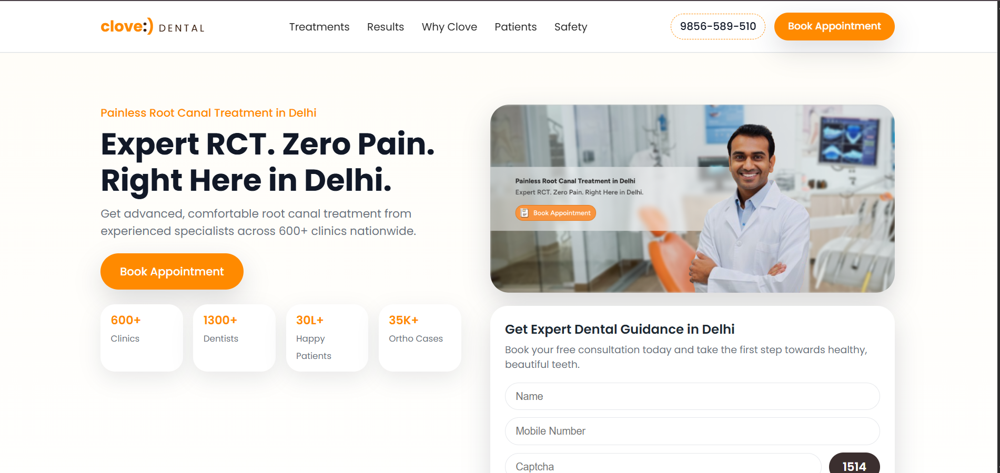
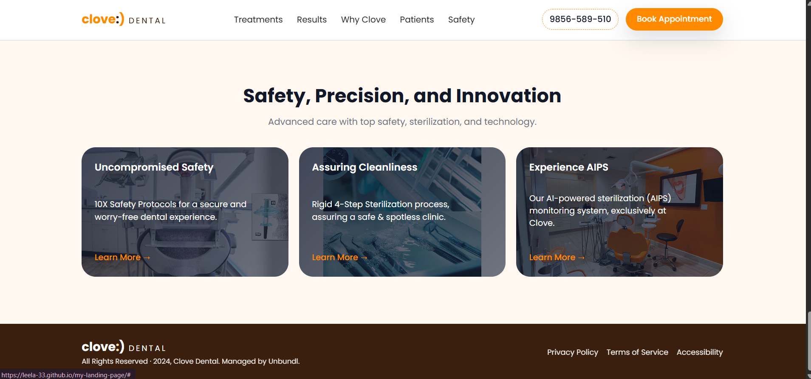

# 🦷 Clove Dental – Responsive Landing Page  
A fully responsive and pixel-perfect landing page built from the Clove Dental Figma design as part of the **Unbundl Assignment**.

---

## 🔗 Live Demo
- **Live URL:** https://leela-33.github.io/my-landing-page/
  
- **GitHub Repository:** https://github.com/leela-33/my-landing-page

> (After deployment I will help you replace the link.)

---

## 🧱 Tech Stack
- **HTML5**
- **CSS3** (Flexbox, Grid, Media Queries)
- **JavaScript** (Vanilla JS)

---

## 📚 Sections Implemented (Total 6)
1. **Hero Section** – Image + CTA + Stats  
2. **Root Canal Treatments** – Treatment cards  
3. **Real Smiles, Real Transformations** – Before/after photos  
4. **Why Choose Clove Dental** – Benefits section  
5. **What Our Patients Say** – Testimonials  
6. **Safety, Precision & Innovation** – Safety features

---

## 📱 Features
- Fully responsive (mobile, tablet, desktop)
- Pixel-perfect UI based on Figma  
- Clean layout using **CSS Grid + Flexbox**
- Interactive mobile menu  
- Smooth scrolling  
- Reusable components (cards, buttons, grids)

---
## 📸 Screenshots

### Desktop View 1

### Desktop View 2

### Desktop View 3

### Mobile View

